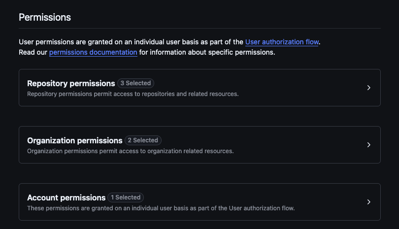

# CICube Enterprise Helm Chart

This Helm chart deploys CICube Enterprise on a Kubernetes cluster.

## Prerequisites

- Kubernetes 1.19+
- Helm 3.0+
- A Kubernetes cluster with access to container registry
- Container registry credentials
- Domain names configured for ingress (api.example.com, cube.example.com, app.example.com)

### GitHub App Installation


1. Go to your GitHub organization settings
2. Navigate to "GitHub Apps" section
3. Click "New GitHub App"
4. Fill in the following details:
   - **App Name**: <Your App Name> // example: frontegg-cicube-enterprise
   - **Homepage URL**: Your CI Cube Enterprise instance URL // example: https://cicube-app.frontegg.com
   - **Webhook URL**: `https://<your-api-domain>/api/github/webhook` // example: https://cicube-api.frontegg.com/api/github/webhook
   - **Expire user authorization tokens**: Uncheck this option
   - **Request user authorization (OAuth) during installation**: Enable this option

   - **Active**: **Uncheck** this option under Webhook section



1. Set the following permissions:
   - **Repository Permissions**:
     - Actions: Read
     - Metadata: Read
     - Webhooks: Read & Write
   - **Organization Permissions**:
     - Members: Read
     - Plan: Read
   - **Account Permissions**:
     - Email addresses: Read

2. After creating the app:
   - Save the App ID
   - Generate and save a secret key
   - Install the app in your organization

3. Update your CI Cube configuration with:
   - App ID
   - Secret key

Note: Make sure your CI Cube instance is accessible from GitHub's IP addresses to receive webhooks.

7. Update your CI Cube configuration with the following environment variables:
   
   For API:
   ```bash
   GITHUB_APP_ID=<your-app-id>
   GITHUB_CLIENT_ID=<your-client-id>
   GITHUB_CLIENT_SECRET=<your-client-secret>
   ```

   For APP:
   ```bash
   VITE_GITHUB_APP_ID=<your-app-id>
   VITE_GITHUB_APP_NAME=<your-app-name> // example: frontegg-cicube-enterprise
   ```

## Installation Steps

1. First, create a registry secret to pull images:
```bash
kubectl create secret docker-registry registry-secret \
  --docker-server=ghcr.io \
  --docker-username=YOUR_GITHUB_USERNAME \
  --docker-password=YOUR_GITHUB_TOKEN \
  --docker-email=YOUR_EMAIL
```

2. Create a `values.yaml` file to override default values. Here's a template:
```yaml
global:
  imagePullSecrets:
    - name: registry-secret

postgresql:
  auth:
    username: "postgres"
    password: "YOUR_PASSWORD"        # Important: This password will be used for all PostgreSQL connections - openssl rand -hex 16
    database: "halley"
    postgresPassword: "YOUR_PASSWORD"  # Must be same as password above

api:
  enabled: true
  ingress:
    enabled: true
    hosts:
      - host: api.example.com  # Your API domain - example: https://cicube-api.frontegg.com
        paths:
          - path: /
            pathType: ImplementationSpecific
    tls:
      - secretName: "api-tls"
        hosts:
          - api.example.com
  env:
    JWT_SECRET: "YOUR_JWT_SECRET"  # Must be same in all JWT references - openssl rand -hex 16
    API_URL: "https://api.example.com"  # Must match ingress host - example: https://cicube-api.frontegg.com
    DATABASE_HOST: "ci-cube-postgresql"  # Default PostgreSQL service name
    DATABASE_USER: "postgres"  # Default PostgreSQL username
    DATABASE_PASSWORD: ""  # IMPORTANT: Must match postgresql.auth.password
    DATABASE_NAME: "halley"  # Default database name
    DATABASE_SSL_MODE: "false"  # SSL mode must be false, never use ignore
    REDIS_HOST: "ci-cube-redis-master"  # Default Redis service name
    REDIS_PORT: "6379"  # Default Redis port

cubejs:
  enabled: true
  ingress:
    enabled: true
    hosts:
      - host: cube.example.com  # Your Cube domain
        paths:
          - path: /
            pathType: ImplementationSpecific
    tls:
      - secretName: "cube-tls"
        hosts:
          - cube.example.com // Your Cube domain - example: https://cicube-cube.frontegg.com
  cubeApi:
    env:
      var:
        CUBEJS_API_SECRET: "YOUR_JWT_SECRET"  # Must match JWT_SECRET above
        CUBEJS_DB_TYPE: "postgres"  # Database type
        CUBEJS_DB_HOST: "ci-cube-postgresql"  # Default PostgreSQL service name
        CUBEJS_DB_NAME: "halley"  # Default database name
        CUBEJS_DB_USER: "postgres"  # Default PostgreSQL username
        CUBEJS_DB_PASS: ""  # IMPORTANT: Must match postgresql.auth.password
        CUBEJS_DB_SSL: "false"  # SSL mode must be false, never use ignore
        CUBEJS_DEV_MODE: "false"  # Development mode disabled by default
        CUBEJS_CUBESTORE_HOST: "ci-cube-cubejs-cubestore-router"  # Default CubeStore router service name
        CUBEJS_LOG_LEVEL: "error"  # Default log level

  cubeRefreshWorker:
    env:
      var:
        CUBEJS_DB_TYPE: "postgres"
        CUBEJS_DB_HOST: "ci-cube-postgresql"
        CUBEJS_DB_NAME: "halley"
        CUBEJS_DB_USER: "postgres"
        CUBEJS_DB_PASS: ""  # IMPORTANT: Must match postgresql.auth.password
        CUBEJS_DB_SSL: "false"  # SSL mode must be false, never use ignore
        CUBEJS_DEV_MODE: "false"
        CUBEJS_REFRESH_WORKER: "true"
        CUBEJS_LOG_LEVEL: "error"

app:
  enabled: true
  ingress:
    enabled: true
    hosts:
      - host: app.example.com  # Your App domain
        paths:
          - path: /
            pathType: ImplementationSpecific
    tls:
      - secretName: "app-tls"
        hosts:
          - app.example.com
  env:
    VITE_API_URL: "https://api.example.com"    # Must match API ingress host - example: https://cicube-api.frontegg.com
    VITE_WEB_URL: "https://app.example.com"    # Must match App ingress host - example: https://cicube-app.frontegg.com
    VITE_CUBE_API_URL: "https://cube.example.com"  # Must match Cube ingress host - example: https://cicube-cube.frontegg.com
```

3. Install the Helm chart:
```bash
helm install ci-cube . -f values.yaml -n your-namespace
```

## Important Configuration Notes

### Domain and Ingress Configuration
The chart uses three main domains that need to be configured:

1. API Domain (api.example.com):
   - Set in `api.ingress.hosts[0].host`
   - Used in `api.env.API_URL`
   - Referenced in `app.env.VITE_API_URL`

2. Cube Domain (cube.example.com):
   - Set in `cubejs.ingress.hosts[0].host`
   - Referenced in `app.env.VITE_CUBE_API_URL`

3. App Domain (app.example.com):
   - Set in `app.ingress.hosts[0].host`
   - Used in `app.env.VITE_WEB_URL`

Make sure these domains are consistent across your configuration. All URLs should use HTTPS protocol.

### PostgreSQL Configuration
Database passwords must be identical in these locations:
- `postgresql.auth.password`
- `postgresql.auth.postgresPassword`
- `api.DATABASE_PASSWORD`
- `cubejs.cubeApi.env.var.CUBEJS_DB_PASS`
- `cubejs.cubeRefreshWorker.env.var.CUBEJS_DB_PASS`

IMPORTANT NOTES:
1. All database passwords must be identical across all locations
2. When changing the password, update it in all locations
3. Password should be at least 12 characters long and include complex characters
4. Pods may need to be restarted after password changes

The chart will automatically configure all necessary database connections using these credentials.

### Redis Configuration
The chart includes Redis as a dependency for the API component. Redis is configured with:
- Standalone architecture (no replication)
- No persistence
- No authentication
- Default port: 6379

The Redis host will be automatically configured as: `ci-cube-redis-master`

### JWT Secret Configuration
The JWT secret must be the same in these locations:
- `api.env.JWT_SECRET`
- `cubejs.cubeApi.env.var.CUBEJS_API_SECRET`

### Cube.js Configuration
Database configuration must be identical for both cubeApi and cubeRefreshWorker:
- `cubejs.cubeApi.env.var.CUBEJS_DB_PASS`
- `cubejs.cubeRefreshWorker.env.var.CUBEJS_DB_PASS`
Both must match `postgresql.auth.password`

Default Service Names:
- PostgreSQL: `ci-cube-postgresql`
- CubeStore Router: `ci-cube-cubejs-cubestore-router`

IMPORTANT NOTES:
1. Database passwords must be identical across all components
2. SSL mode must be set to "false", never use "ignore"
3. Development mode should be disabled in production
4. Log level should be set to "error" in production

## Upgrading

To upgrade the release:
```bash
helm upgrade ci-cube . -f values.yaml -n your-namespace
```

## Uninstalling

To uninstall/delete the deployment:
```bash
helm uninstall ci-cube -n your-namespace
```

## Configuration Options

### Global Options
| Parameter | Description | Default |
|-----------|-------------|---------|
| `global.imagePullSecrets` | Global image pull secrets | `[{name: registry-secret}]` |

### Ingress Options
| Parameter | Description | Default |
|-----------|-------------|---------|
| `api.ingress.hosts[0].host` | API domain name | `api.example.com` |
| `cubejs.ingress.hosts[0].host` | Cube domain name | `cube.example.com` |
| `app.ingress.hosts[0].host` | App domain name | `app.example.com` |

### PostgreSQL Options
| Parameter | Description | Default |
|-----------|-------------|---------|
| `postgresql.auth.username` | PostgreSQL username | `postgres` |
| `postgresql.auth.password` | PostgreSQL password | `postgres123` |
| `postgresql.auth.database` | PostgreSQL database name | `halley` |
| `postgresql.auth.postgresPassword` | PostgreSQL admin password | Same as password |

### Redis Options
| Parameter | Description | Default |
|-----------|-------------|---------|
| `api.redis.enabled` | Enable Redis | `true` |
| `api.redis.architecture` | Redis architecture | `standalone` |
| `api.redis.auth.enabled` | Enable Redis authentication | `false` |
| `api.redis.master.persistence.enabled` | Enable Redis persistence | `false` |

## Troubleshooting

1. If pods are not starting, check the image pull secrets:
```bash
kubectl get events -n your-namespace
```

2. To check PostgreSQL connection:
```bash
kubectl exec -it <pod-name> -n your-namespace -- psql -U postgres -d halley
```

3. To view application logs:
```bash
kubectl logs -f <pod-name> -n your-namespace
```

4. To check PostgreSQL pod status:
```bash
kubectl get pods -l app.kubernetes.io/name=postgresql -n your-namespace
```

5. To check ingress configuration:
```bash
kubectl get ingress -n your-namespace
kubectl describe ingress <ingress-name> -n your-namespace
```
### Database SSL Configuration
SSL mode configuration is critical for security:
- `api.DATABASE_SSL_MODE` must be set to "false"
- `cubejs.cubeApi.env.var.CUBEJS_DB_SSL` must be set to "false"
- `cubejs.cubeRefreshWorker.env.var.CUBEJS_DB_SSL` must be set to "false"
